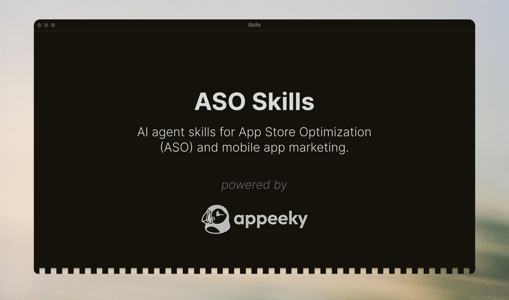

# ASO & App Marketing Skills

<a href="https://docs.appeeky.com">
  
</a>
<div align="center">
<p align="center">
  <a href="https://x.com/appeeky">
    
  </a>
  <a href="https://www.linkedin.com/in/erencanarica/">
    
  </a>
  </p>
</div>

AI agent skills for App Store Optimization (ASO) and mobile app marketing. Built for indie developers, app marketers, and growth teams who want **Cursor**, **Claude Code**, or any [Agent Skills](https://agentskills.io)-compatible AI assistant to help with keyword research, metadata optimization, competitor analysis, market intelligence, and app growth.

Powered by real App Store data via the [Appeeky API](https://docs.appeeky.com).

## Why This Exists

Most ASO knowledge lives in blog posts, courses, and expensive consultants. We packaged it into skills that any AI agent can use — so you get expert-level ASO guidance directly in your IDE.

Each skill contains battle-tested frameworks, scoring rubrics, and output templates. The agent reads the skill, pulls real data from the App Store (via Appeeky), and gives you actionable recommendations — not generic advice.

## Quick Start

**Cursor** — Settings (Cmd+Shift+J) → Rules → Add Rule → Remote Rule (Github) → paste `https://github.com/eronred/aso-skills`

**Claude Code** — `npx skills add eronred/aso-skills`

**Manual** — `git clone https://github.com/eronred/aso-skills.git && cp -r aso-skills/skills/* .cursor/skills/`

Then ask your agent:

```
"Run an ASO audit for my app (id: 1617391485)"
"Find the best keywords for a meditation app"
"Optimize my App Store title and subtitle"
"How many downloads do I need to reach top 10 in Health & Fitness?"
"What apps are rising in the charts right now?"
"Give me a market briefing for the Games category"
```

Or invoke directly: `/aso-audit`, `/keyword-research`, `/metadata-optimization`, `/market-movers`, `/market-pulse`

## Skills

### ASO Core

| Skill | What it does |
|-------|-------------|
| [`aso-audit`](skills/aso-audit) | Scores your listing across 10 factors (0-100), flags problems, gives a prioritized fix list |
| [`keyword-research`](skills/keyword-research) | Finds keywords by volume × difficulty × relevance, groups them into primary/secondary/long-tail |
| [`metadata-optimization`](skills/metadata-optimization) | Writes title, subtitle, keyword field, description — with 3 variants and character counts |
| [`competitor-analysis`](skills/competitor-analysis) | Keyword gaps, creative teardown, positioning map, and specific opportunities to exploit |

### Creative & International

| Skill | What it does |
|-------|-------------|
| [`screenshot-optimization`](skills/screenshot-optimization) | 10-slot screenshot strategy with design briefs, text overlay copy, and competitor audit |
| [`review-management`](skills/review-management) | Sentiment analysis, response templates (HEAR framework), rating improvement tactics |
| [`localization`](skills/localization) | Market prioritization matrix, per-country keyword research, cultural adaptation checklist |

### Growth

| Skill | What it does |
|-------|-------------|
| [`app-launch`](skills/app-launch) | 8-week launch timeline with daily checklists, channel strategy, and press outreach templates |
| [`ua-campaign`](skills/ua-campaign) | Apple Search Ads, Meta, Google UAC — campaign structure, bidding, creative specs, budget allocation |
| [`app-store-featured`](skills/app-store-featured) | Featuring readiness score, Apple tech checklist, pitch template, In-App Events calendar |

### Revenue & Retention

| Skill | What it does |
|-------|-------------|
| [`monetization-strategy`](skills/monetization-strategy) | Pricing tiers, paywall timing/design, trial optimization, category benchmarks |
| [`retention-optimization`](skills/retention-optimization) | Activation → habit → engagement framework, push notification sequences, churn prevention |

### Analytics & Testing

| Skill | What it does |
|-------|-------------|
| [`app-analytics`](skills/app-analytics) | Event tracking plan, dashboard setup, KPI framework with category benchmarks |
| [`ab-test-store-listing`](skills/ab-test-store-listing) | Hypothesis → variant design → sample size → interpretation for App Store A/B tests |

### Market Intelligence

| Skill | What it does |
|-------|-------------|
| [`market-movers`](skills/market-movers) | Identifies top chart gainers/losers, new entries, and dropped apps — explains what's driving changes |
| [`market-pulse`](skills/market-pulse) | Full market briefing: chart movements + trending keywords + featured apps + new launches in one view |

### Foundation

| Skill | What it does |
|-------|-------------|
| [`app-marketing-context`](skills/app-marketing-context) | Creates a context doc (app, audience, competitors, goals) that all other skills reference |

## How It Works

```
You: "Run an ASO audit for Headspace"

Agent:
  1. Reads aso-audit/SKILL.md (framework, scoring rubric, output template)
  2. Calls Appeeky API → fetches metadata, keywords, ratings, competitors
  3. Scores each factor (title: 8/10, subtitle: 6/10, keywords: 4/10...)
  4. Returns: ASO Score Card + Quick Wins + High-Impact Changes + Strategic Recs
```

Skills reference each other — `aso-audit` might suggest running `keyword-research` for deeper analysis, which then feeds into `metadata-optimization` for implementation.

## Installation

### Cursor

| Method | Command |
|--------|---------|
| GitHub Import | Settings → Rules → Add Rule → Remote Rule → `https://github.com/eronred/aso-skills` |
| Project-level | `cp -r aso-skills/skills/* .cursor/skills/` |
| Global | `cp -r aso-skills/skills/* ~/.cursor/skills/` |

### Claude Code

| Method | Command |
|--------|---------|
| CLI | `npx skills add eronred/aso-skills` |
| Specific skills | `npx skills add eronred/aso-skills --skill aso-audit keyword-research` |
| Manual | `cp -r aso-skills/skills/* .claude/skills/` |

### Any Agent

```bash
git submodule add https://github.com/eronred/aso-skills.git .agents/aso-skills
```

Works with any tool that supports the [Agent Skills](https://agentskills.io) standard (`.agents/skills/`, `.cursor/skills/`, `.claude/skills/`, `.codex/skills/`).

## Appeeky Integration

Skills work standalone with general ASO knowledge. Connect [Appeeky](https://docs.appeeky.com/mcp) for real-time App Store data:

```json
{
  "mcpServers": {
    "appeeky": {
      "url": "https://mcp.appeeky.com/mcp",
      "headers": { "Authorization": "Bearer apk_your_key_here" }
    }
  }
}
```

With Appeeky connected, skills can pull live keyword rankings, competitor metadata, download estimates, trending keywords, and featured apps. See [tools/REGISTRY.md](tools/REGISTRY.md) for the full capability matrix.

## Contributing

PRs welcome — fix an inaccuracy, improve a framework, or add a new skill. See [CONTRIBUTING.md](CONTRIBUTING.md).

## License

MIT
